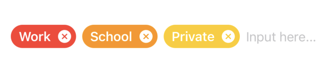

# TagForm
> Short blurb about what your product does.

[![Swift Version][swift-image]][swift-url]
[![Build Status][travis-image]][travis-url]
[![License][license-image]][license-url]

One to two paragraph statement about your product and what it does.




## Installation

Add this project on your `Package.swift`

```swift
import PackageDescription

let package = Package(
    dependencies: [
        .Package(url: "https://github.com/issetwo/tagform.git", majorVersion: 0, minor: 0)
    ]
)
```

## Usage example


```swift
import SwiftUI
import TagForm

struct ContentView: View {
    @State private var tagInfoList: [TagInfo] = [TagInfo]()
    
    var body: some View {
        TagForm(tagInfoList: $tagInfoList, placeholder: "Input here...", tagColer: .black)
            .padding()
    }
}
```


## Development setup

Describe how to install all development dependencies and how to run an automated test-suite of some kind. Potentially do this for multiple platforms.

```sh
make install
```

## Release History

* 0.0.1
    * Work in progress

## Meta

Kazuto Yamada – [@issetwo](https://twitter.com/issetwo)

Distributed under the MIT license. See ``LICENSE`` for more information.

[https://github.com/issetwo/tagform](https://github.com/issetwo)

[swift-image]:https://img.shields.io/badge/swift-5.0-orange.svg
[swift-url]: https://swift.org/
[license-image]: https://img.shields.io/badge/License-MIT-blue.svg
[license-url]: LICENSE
[travis-image]: https://img.shields.io/travis/dbader/node-datadog-metrics/master.svg
[travis-url]: https://travis-ci.org/dbader/node-datadog-metrics
